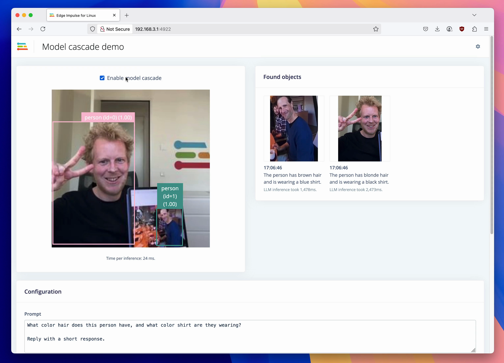

# Model cascade with Edge Impulse (Object detection -> Object tracking -> LLM)

This repository contains a demo using an Object tracking model to find interesting parts of an image, then cascade to GPT-4o to do further analysis.



## Building an object tracking model

You'll need a trained object tracking model in Edge Impulse.

1. Train an object detection model.
2. Go to **Dashboard > Administrative zone** and toggle 'Enable object tracking' (available for Enterprise projects only).
3. Download your model in .eim format, including hardware optimization via:

    ```
    $ edge-impulse-linux-runner --clean --download path-to-your-model.eim
    ```

    (Alternatively, go to **Deployment** in your Edge Impulse project, find the 'Linux' deployment for your architecture (e.g. 'Linux (AARCH64)'), and build from there).

## Setup

1. Install dependencies:

    ```
    npm install
    ```

2. Set your OpenAI API Key:

    ```
    export OPENAI_API_KEY=sk-MA...
    ```

3. Run the application:

    ```
    npm run build && node build/classify-camera-webserver.js ./path-to-your-model.eim
    ```

    If you have multiple cameras a message will be printed, and you should add the camera name as the last argument to the script above.

4. Go to http://localhost:4922/ and see the cascade working.
